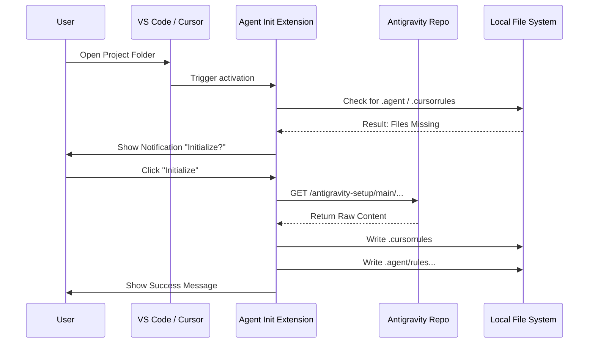

# System Architecture: Agent Init

## 1. High-Level Design

Agent Init operates as a client-side extension within the VS Code / Cursor host environment. It acts as a facilitator between a remote standard definition (GitHub Repository) and the local development environment (User Workspace).

### Architectural Pattern
**Event-Driven Modular Monolith**
- **Event-Driven:** Actions are triggered by IDE events (Startup, Folder Open, Command).
- **Modular:** Logic is separated into distinct providers (Network, Filesystem, UI).

## 2. Quality Attributes

### 2.1 Performance
| Attribute | Requirement | Justification |
|-----------|-------------|---------------|
| Startup Time | < 100ms overhead | Must not delay IDE startup |
| Detection Latency | < 500ms | Fast check for existing standards |
| File Write | < 2 seconds | Reasonable time for file creation |
| Memory Usage | < 50MB | Lightweight extension footprint |

### 2.2 Security
| Attribute | Requirement | Justification |
|-----------|-------------|---------------|
| Scope Isolation | Workspace-only | Prevent access outside project |
| Content Validation | Text-only | Prevent executable injection |
| Source Pinning | Hardcoded repo | Prevent redirect attacks |

### 2.3 Maintainability
| Attribute | Requirement | Justification |
|-----------|-------------|---------------|
| Modular Design | Separate services | Easy to test and maintain |
| Error Handling | Graceful degradation | No crashes on failures |
| Logging | Structured logs | Debug support |

### 2.4 Scalability
| Attribute | Requirement | Justification |
|-----------|-------------|---------------|
| Stateless | No persistent state | Simple deployment |
| Template Agnostic | Decoupled content | Easy to add new templates |

## 3. Component Architecture

### The Core Layer (`ExtensionContext`)
The brain of the extension. It manages the lifecycle, subscriptions, and global state.
- **Activation:** Initializes the `Watcher`.
- **Deactivation:** Cleans up listeners.

### The Service Layer

#### 1. Watcher Service
Scans the file system structure. It is designed to be "lazy" – it doesn't deeply scan all files, only checks for the existence of specific "Flag Files" (`.agent`, `.cursorrules`) at the root level.

**Interface:**
```typescript
interface IWatcherService {
  checkStandardsExist(workspacePath: string): Promise<boolean>;
  watchWorkspace(callback: (path: string) => void): void;
}
```

#### 2. Network Service (GitHub Client)
A lightweight wrapper around the `fetch` API.
- **Interface:** `ITemplateProvider`
- **Implementation:** `GitHubRawProvider`
- Can be extended in the future to support GitLab or Bitbucket.

**Interface:**
```typescript
interface ITemplateProvider {
  fetchTemplate(source: TemplateSource): Promise<TemplateContent>;
  validateSource(source: TemplateSource): boolean;
}

interface TemplateSource {
  owner: string;
  repo: string;
  branch: string;
  path: string;
}

interface TemplateContent {
  files: Map<string, string>;
  version: string;
  checksum: string;
}
```

#### 3. Installer Service (File Handler)
Manages the I/O operations.
- Ensures atomic writes where possible.
- Handles directory creation recursively (`mkdir -p` logic).

**Interface:**
```typescript
interface IFileHandler {
  createDirectory(path: string): Promise<void>;
  writeFile(path: string, content: string): Promise<void>;
  fileExists(path: string): Promise<boolean>;
}
```

### The Presentation Layer (VS Code UI)
Uses native VS Code UI components for a seamless experience.
- `vscode.window.showInformationMessage` for the confirmation modal.
- `vscode.window.setStatusBarMessage` for loading states.

## 4. Technology Choices

### 4.1 Runtime & Language
| Technology | Choice | Justification |
|-----------|--------|---------------|
| Runtime | Node.js 18+ | Bundled with VS Code |
| Language | TypeScript | Type safety, better IDE support |
| Strict Mode | Enabled | Catch errors at compile time |

### 4.2 Core Dependencies
| Library | Choice | Justification |
|---------|--------|---------------|
| VS Code API | v1.80.0+ | Minimum version for features |
| Fetch API | Native | No external HTTP client needed |
| Build Tool | webpack | Standard VS Code extension bundler |

### 4.3 Future Extensibility
| Provider | Status | Notes |
|----------|--------|-------|
| GitHub | MVP | Using raw.githubusercontent.com |
| GitLab | Future | Via REST API |
| Bitbucket | Future | Via REST API |

## 5. Data Flow Diagram



## 6. Directory Structure Strategy

The extension enforces the following structure on the target project:

```
project-root/
├── .cursorrules          # Root instruction file for Cursor
├── .agent/               # AI Agent Brain Directory
│   ├── rules/           # Coding standards & architectural guidelines
│   │   ├── code-style.md
│   │   ├── architecture.md
│   │   └── best-practices.md
│   ├── skills/          # AI agent capabilities/competencies
│   │   ├── code-review.md
│   │   ├── testing.md
│   │   └── refactoring.md
│   └── workflows/       # Workflow definitions
│       ├── tdd-workflow.md
│       └── pr-workflow.md
```

## 7. Data Models

### 7.1 Extension Configuration
```typescript
interface AgentInitConfig {
  source: {
    owner: string;
    repo: string;
    branch: string;
  };
  behavior: {
    autoInit: boolean;
    checkOnStartup: boolean;
    watchForDrift: boolean;
  };
  notifications: {
    showSuccess: boolean;
    showErrors: boolean;
  };
}
```

### 7.2 Template Manifest
```typescript
interface TemplateManifest {
  version: string;
  files: {
    path: string;
    type: 'file' | 'directory';
    required: boolean;
  }[];
  metadata: {
    created: string;
    author: string;
    description: string;
  };
}
```

## 8. Error Handling Architecture

### 8.1 Error Categories
| Category | Example | Handling |
|----------|---------|----------|
| Network | Timeout, 404 | Show user-friendly message |
| File System | Permission denied | Log and notify |
| Validation | Invalid content | Skip and warn |
| User | Cancel/Dismiss | Silent exit |

### 8.2 Error Response
```typescript
interface ErrorResponse {
  code: string;
  message: string;
  severity: 'info' | 'warning' | 'error';
  recoverable: boolean;
  action?: string;
}
```

## 9. Scalability Design

- **Stateless:** The architecture is stateless. It does not maintain a database or complex local state.
- **Template Agnostic:** The code logic is decoupled from the *content* of the templates. Adding a new rule file in the GitHub repo does not require updating the extension code, as the extension fetches the "manifest" or list of files dynamically (future feature) or follows a fixed list defined in configuration.

## 10. Cross-Cutting Concerns

### 10.1 Logging
- Use `console.log` for debugging (filtered in production)
- VS Code `outputChannel` for extension logs

### 10.2 Telemetry
- Anonymous usage metrics (opt-in future)
- Track: initialization success, error frequency

### 10.3 Configuration Storage
- VS Code `workspaceState` for session data
- VS Code `globalState` for user preferences
- No external storage required
