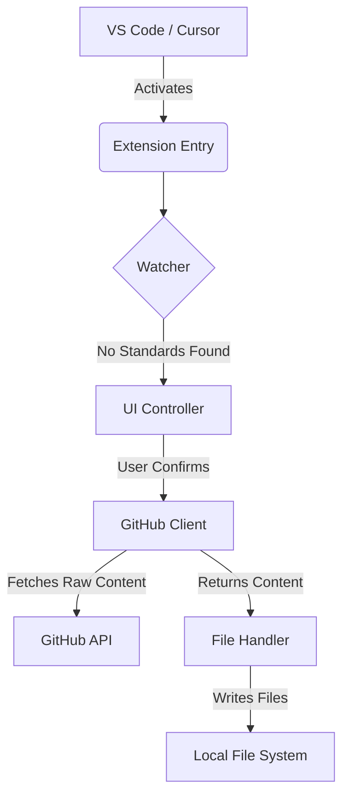

# Technical Specifications
**Project:** Agent Init
**Version:** 0.1 (MVP)
**Framework:** VS Code Extension API
**Last Updated:** 2026-02-13

## 1. Technology Stack
-   **Runtime:** Node.js (bundled with VS Code).
-   **Language:** TypeScript (Strict Mode enabled).
-   **Core API:** `vscode` module (v1.80.0+ compatibility).
-   **Networking:** Native `fetch` API (No external dependencies like Axios to keep bundle size minimal).
-   **Build Tool:** `ts-loader` / `webpack` (standard via `yo code` generator).

## 2. Version Compatibility

### 2.1 VS Code Compatibility Matrix
| VS Code Version | Support Status | Notes |
|-----------------|----------------|-------|
| 1.80.0+ | ✅ Full Support | Minimum required |
| 1.75.0 - 1.79.x | ⚠️ Limited | Core features work |
| < 1.75.0 | ❌ Not Supported | API incompatible |

### 2.2 Platform Support
| Platform | Support Status |
|----------|----------------|
| Windows (x64) | ✅ Full Support |
| macOS (Intel) | ✅ Full Support |
| macOS (Apple Silicon) | ✅ Full Support |
| Linux (x64) | ✅ Full Support |

## 3. Architecture Overview
The extension follows a modular architecture to separate concerns between UI, Data Fetching, and File System operations.

### Component Diagram


## 4. Project File Structure

### 4.1 Extension Source Structure
```
agent-init/
├── src/
│   ├── extension.ts          # Entry point
│   ├── watcher.ts           # File system watcher
│   ├── github-client.ts     # GitHub API client
│   ├── file-handler.ts     # File I/O operations
│   ├── ui-controller.ts     # VS Code UI management
│   ├── config.ts           # Configuration management
│   └── types/
│       └── index.ts         # TypeScript interfaces
├── test/
│   ├── extension.test.ts   # Integration tests
│   └── suite/              # Test suites
├── resources/
│   └── icon.png            # Extension icon
├── package.json            # Extension manifest
├── tsconfig.json          # TypeScript config
├── webpack.config.js      # Build configuration
└── README.md              # Extension README
```

### 4.2 Target Project Structure (Generated)
```
project-root/
├── .cursorrules           # Root instruction file
└── .agent/               # AI Agent configuration
    ├── rules/            # Coding standards
    ├── skills/           # Agent capabilities
    └── workflows/        # Workflow definitions
```

## 5. Data Flow Strategy

### 5.1. Detection Phase
1.  **Event:** `vscode.workspace.onDidOpenWorkspaceFolders` or standard activation `onStartupFinished`.
2.  **Logic:** `FileSystem.stat` checks for `.agent/` directory and `.cursorrules` file.
3.  **Optimization:** Check happens asynchronously to avoid blocking the UI thread.

### 5.2. Fetching Phase
-   **Source:** Raw GitHub User Content.
-   **Endpoint:** `https://raw.githubusercontent.com/irahardianto/antigravity-setup/main/...`
-   **Method:** `GET` standard HTTPS request.
-   **Caching:** In-memory caching for the duration of the session/command execution (no persistent storage for templates in MVP).

### 5.3. Execution Phase
1.  **User Action:** Click "Initialize" via `vscode.window.showInformationMessage`.
2.  **Operation:** `vscode.workspace.fs.writeFile`.
3.  **Encoding:** `TextEncoder` to convert fetched strings to `Uint8Array`.

## 6. Configuration Schema

### 6.1 User Settings
```typescript
interface AgentInitSettings {
  // Behavior
  autoInit: boolean;           // Auto-initialize without prompt
  checkOnStartup: boolean;    // Check for standards on startup
  watchForDrift: boolean;    // Monitor for file changes

  // Notifications
  showSuccess: boolean;       // Show success notifications
  showErrors: boolean;       // Show error notifications

  // Source (Future)
  sourceOwner?: string;      // Custom source owner
  sourceRepo?: string;       // Custom source repository
  sourceBranch?: string;     // Custom source branch
}
```

### 6.2 Default Settings
```json
{
  "agentInit.autoInit": false,
  "agentInit.checkOnStartup": true,
  "agentInit.watchForDrift": false,
  "agentInit.showSuccess": true,
  "agentInit.showErrors": true
}
```

## 7. Error Handling

### 7.1 Error Codes Catalog
| Code | Category | Message | Resolution |
|------|----------|---------|------------|
| ERR_NETWORK_TIMEOUT | Network | Request timed out after 30s | Check internet connection, try again |
| ERR_NETWORK_404 | Network | Template not found | Check repository exists |
| ERR_NETWORK_500 | Network | GitHub server error | Try again later |
| ERR_NETWORK_OFFLINE | Network | No internet connection | Connect to internet |
| ERR_FILE_PERMISSION | File System | Permission denied | Check folder permissions |
| ERR_FILE_EXISTS | File System | File already exists | Enable overwrite in settings |
| ERR_DIR_CREATE | File System | Cannot create directory | Check write permissions |
| ERR_CONTENT_INVALID | Validation | Invalid template content | Contact repository maintainer |
| ERR_USER_CANCELLED | User | Operation cancelled by user | No action needed |
| ERR_WORKSPACE_NO_FOLDER | Workspace | No folder open | Open a folder first |

### 7.2 Error Response Format
```typescript
interface ExtensionError {
  code: string;
  message: string;
  details?: string;
  action?: string;
  recoverable: boolean;
}
```

### 7.3 Error Messages
-   **Network Error:** "Unable to fetch standards from GitHub. Check internet connection."
-   **Permission Error:** "Write permission denied for current workspace."
-   **User Cancel:** Silent exit or debug log.

## 8. Performance Requirements

### 8.1 Performance Benchmarks
| Operation | Target | Maximum |
|-----------|--------|---------|
| Extension Activation | < 100ms | 200ms |
| Standards Detection | < 500ms | 1s |
| Template Fetch (1 file) | < 2s | 5s |
| Template Fetch (10 files) | < 5s | 10s |
| File Write (per file) | < 200ms | 500ms |
| Memory Usage (idle) | < 30MB | 50MB |
| Memory Usage (active) | < 50MB | 100MB |

### 8.2 Network Optimization
- Use `raw.githubusercontent.com` (not API) for higher rate limits
- Implement session-level caching to reduce repeat fetches
- Use HTTP/2 multiplexing where available

## 9. Implementation Details

### 9.1. Naming Conventions
-   **Files:** `kebab-case.ts` (e.g., `github-client.ts`, `file-manager.ts`).
-   **Functions:** `camelCase` with verb prefix (e.g., `fetchLatestTemplate`, `checkWorkspaceStatus`).
-   **Variables:** `camelCase` descriptive names.
-   **Classes:** `PascalCase` (e.g., `TemplateManager`).

### 9.2. Core Modules

#### `src/extension.ts`
-   **Role:** Entry point.
-   **Responsibilities:**
    -   Registers commands (`agentInit.initialize`).
    -   Sets up the detection watcher.
    -   Handles activation context.

#### `src/watcher.ts`
-   **Role:** Project Monitor.
-   **Responsibilities:**
    -   Iterates through workspace folders.
    -   Returns boolean status (`hasStandard: boolean`).

#### `src/github-client.ts`
-   **Role:** Remote Data Provider.
-   **Responsibilities:**
    -   Defines template URLs.
    -   Executes `fetch` requests.
    -   Handles network errors (404, 500, Timeout).

#### `src/file-handler.ts`
-   **Role:** Disk Operator.
-   **Responsibilities:**
    -   Safe writing to disk.
    -   Directory creation (`.agent/`).
    -   Logging operations.

## 10. Security Considerations
-   **Scope Isolation:** Operations are strictly limited to `vscode.workspace.workspaceFolders`.
-   **No Executables:** The extension only writes text/markdown/json files. It DOES NOT execute logical scripts or binaries.
-   **Content Verification:** basic validation that fetched content is not empty before writing.
-   **Source Pinning:** Hardcoded to `irahardianto/antigravity-setup` (MVP).

## 11. API Reference

### 11.1 Commands
| Command | ID | Description |
|---------|-----|-------------|
| Initialize | `agentInit.initialize` | Force initialization |
| Check Status | `agentInit.checkStatus` | View current status |
| Repair | `agentInit.repair` | Repair/reinstall |

### 11.2 Events
| Event | Description |
|-------|-------------|
| `onDidOpenWorkspaceFolders` | Triggered when folder opens |
| `onDidChangeWorkspaceFolders` | Triggered when workspace changes |

## 12. Testing Requirements

### 12.1 Test Categories
| Category | Coverage Target | Tools |
|----------|-----------------|-------|
| Unit Tests | 80% | Jest |
| Integration Tests | Core flows | VS Code Test Runner |
| E2E Tests | Critical paths | VSCode Extension Tester |

### 12.2 Test Scenarios
- Extension activation/deactivation
- File detection logic
- Network error handling
- File write operations
- User interaction flows
